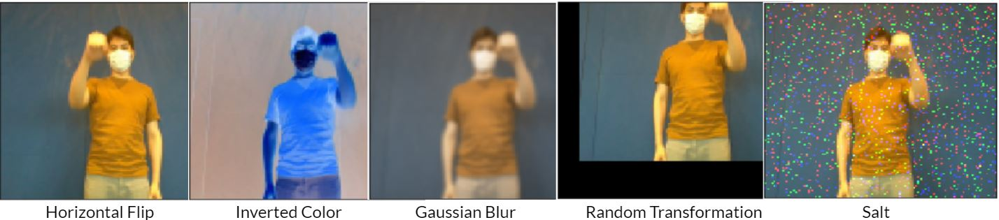
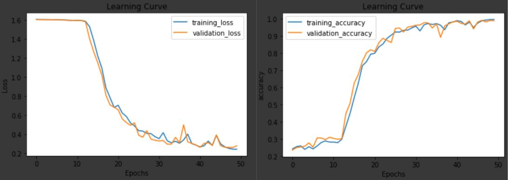
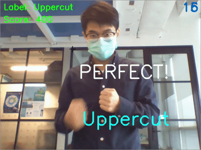

# BeatBoxing - Real time Gesture Recognition
This project is a boxing minigame implemented with a self-trained deep learning model (3DCNN+LSTM) using OpenCV, Keras/Tensorflow libraries in Python

### Preprocessing
Due to the limited amount of data we collected, we use the below methods to increase the size of the dataset:
1. Video Subsampling
2. Video Augmentation (Credits to https://github.com/okankop/vidaug)

The model is taking 24frames for prediction, so make sure you pass videos with 24frames to train the model.

### Training Result
After training for 50 epochs, we achieved >95% of validation accuracy.

### Demo

We took a multithreaded approach to separate the reading of frames on the webcam from the object detection model, achieving concurrency and parallelism.
